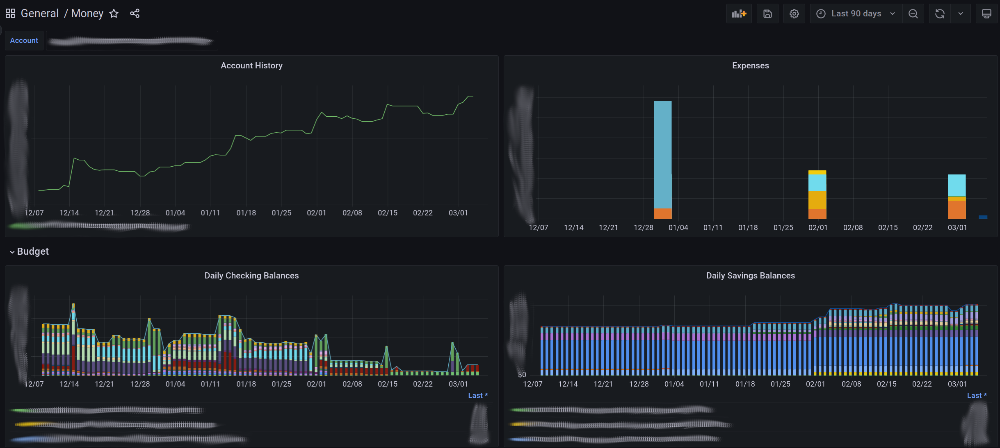

# hledger-influx

This is a project for exporting an `hledger` ledger into influxdb line format.

## Usage

Use the `bal`, `-O csv`, and `-DH` options of `hledger bal` to print a csv report in the right format for this program:

```
hledger bal --infer-market-prices -V -X=$ not:tag:clopen -O csv -DH --transpose | hledger-influx | influx write ...
```

## Caveats / Gotchas

1. This program expects a single currency/commodity. In the example above, it converts everything to USD with `-X=$` (along with `--infer-market-prices`).
2. It only works with USD/`$` currency symbols.

## Grafana Dashboard

JSON for a basic grafana dashboard lives in `grafana/` directory.

